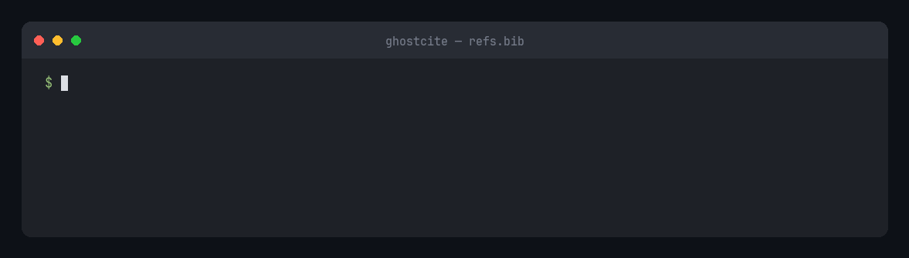
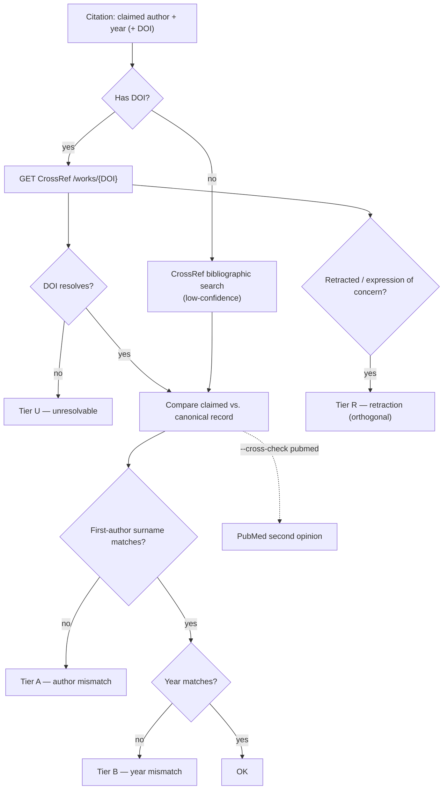
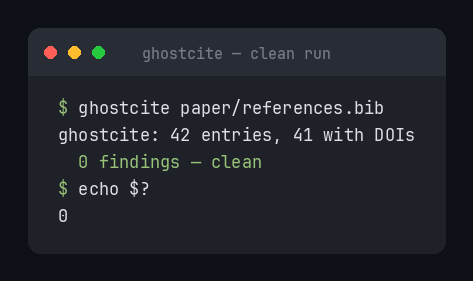

# ghostcite

<p align="center"></p>

[](https://pypi.org/project/ghostcite/)
[](https://github.com/musharna/ghostcite/actions/workflows/ci.yml)
[](LICENSE)
[](https://www.python.org/downloads/)

**Catch ghost citations — right DOI, wrong author.**

<p align="center"></p>

`ghostcite` is a deterministic, **no-LLM** command-line tool that cross-checks a
bibliography's _claimed_ author and year against CrossRef's canonical record for
each DOI. It catches the dominant ghost-citation failure mode — a reference whose
cited authorship doesn't match the paper the DOI actually points to — and flags
retracted or expression-of-concern works along the way.

## The problem

LLM-assisted writing (and plain copy-paste drift) routinely produces references
that _look_ right but attribute the cited DOI to the wrong authors or year. A
manuscript cites "Li et al. 2024," but DOI `10.3390/plants13060869` is actually
**Chen et al.** A reviewer catches it; an automated check catches it first.

> Does the metadata you wrote for this citation match what CrossRef says the DOI actually is?

No model, no API key, **no GPU**, no download — just CrossRef's REST API and a
comparison. It runs in seconds on any CI runner, where the heavyweight LLM-based
checkers can't (those need a local GPU — see [Related work](#related-work--faq)).

## Install

```bash
pip install ghostcite          # into the current environment
pipx install ghostcite         # isolated CLI install (recommended)
uv tool install ghostcite      # if you use uv
```

## Usage

```bash
ghostcite refs.bib                                    # check a BibTeX file (or .md / DOI list)
ghostcite refs.bib --cross-check pubmed               # corroborate against PubMed
ghostcite refs.bib --cross-check pubmed,openalex      # two independent sources of truth
ghostcite refs.bib --badge badge.json                 # write a shields.io citation-health badge
ghostcite refs.bib --json                             # machine-readable output (for CI)
ghostcite refs.bib --fail-on author,year,retraction   # tune the CI gate
cat refs.bib | ghostcite -                            # read from stdin
```

Input format is auto-detected (BibTeX, Markdown reference list, or bare DOI list);
override with `--format {auto,bibtex,markdown,doi}`.

**Real example** — `refs.bib` cites "Li (2024)" for a DOI CrossRef says is Chen:

```text
$ ghostcite refs.bib
ghostcite: 1 entries, 1 with DOIs
  ✗ A  L1  Li (2024)  →  DOI resolves to Chen (2024) — possibly wrong DOI  [10.3390/plants13060869]
  1 A
$ echo $?
1
```

<details>
<summary><b>All flags &amp; the anatomy of a finding</b></summary>

```text
  ✗ A   L1    Li (2024)        →  DOI resolves to Chen (2024)…   [10.3390/plants13060869]
  │ │   │     │                    │                               │
  │ │   │     │                    │                               └─ DOI that was checked
  │ │   │     │                    └─ what CrossRef actually records
  │ │   │     └─ what you cited (claimed first author + year)
  │ │   └─ source line in your bibliography
  │ └─ tier: A author · T title · B year · C cosmetic · R retraction · U unresolvable · V venue
  └─ glyph: ✗ fails CI · ⚠ retraction · · informational
```

- **`--cross-check pubmed`** — adds PubMed/NCBI as a _second source of truth_.
  When PubMed backs CrossRef a finding is annotated `↳ corroborated by PubMed`;
  when PubMed instead agrees with what you _cited_, it's flagged as a CrossRef↔PubMed
  conflict (the tier is kept so you don't silently trust either source). PubMed can
  also _raise_ a finding CrossRef missed, or supply a record for a DOI absent from
  CrossRef. Optional `--ncbi-email` / `--ncbi-api-key` (or `NCBI_EMAIL` /
  `NCBI_API_KEY`) follow NCBI E-utilities etiquette and unlock a higher rate limit;
  neither is required. `--cross-check` accepts a comma-separated list:
  **`--cross-check pubmed,openalex`** runs both PubMed and OpenAlex in the same pass
  (OR-combining retraction, mirroring the PubMed corroborate/conflict/raise logic).
  Optional `--openalex-mailto` / `OPENALEX_MAILTO` for the OpenAlex polite pool.
- **`--badge <path>`** — write a [shields.io endpoint](https://shields.io/badges/endpoint-badge)
  badge JSON to `<path>`. Green when the run is clean; red with a count when findings
  at the current `--fail-on` threshold are present. Warn-only tiers (`C`, `U`, `V`)
  do not turn the badge red. Serve the file from any static host and embed it with:
  `https://img.shields.io/endpoint?url=<raw-url-to-badge.json>`.
- **`--no-doi-probe`** — skip the best-effort `HEAD https://doi.org/<doi>` probe that
  ghostcite performs when a DOI is absent from CrossRef. The probe distinguishes
  "dead/fabricated DOI" from "resolves but not in CrossRef" and refines the Tier U
  message; pass `--no-doi-probe` for fully offline or air-gapped runs.
- **`--max-rps <n>`** — cap outbound requests per second. ghostcite already
  self-throttles to CrossRef's advertised rate limit (read from the response
  headers); `--max-rps` lets you be _more_ conservative (the stricter of the two wins).
- **`--color {auto,always,never}`** — colorize the tier glyphs. `auto` (default)
  colorizes only on a TTY. [`NO_COLOR`](https://no-color.org/) is honored and wins
  even over `always`. `--json` output is never colorized.
- **stdin (`-`)** — pass `-` as the filename to read from stdin, e.g.
  `cat refs.bib | ghostcite -` or `ghostcite - --format doi < dois.txt`.
- **`--dry-run`** — parse + classify + count only, no network.

See [`examples/`](examples/) for ready-to-run sample inputs and captured output.

</details>

## How it works



No language model is involved at any step. ghostcite resolves each DOI at CrossRef
(and optionally PubMed), then does a pure, deterministic comparison of the claimed
first-author surname (Unicode-folded, punctuation-stripped) and year against the
canonical record, plus a retraction / expression-of-concern check. Only the HTTP
client touches the network, via CrossRef's polite pool (a descriptive `User-Agent`
with the project URL, never a personal email).

<details>
<summary><b>Severity tiers, input formats &amp; exit codes</b></summary>

| Tier   | Meaning                                                                                             | Fails CI?                       |
| ------ | --------------------------------------------------------------------------------------------------- | ------------------------------- |
| **A**  | author-mismatch — claimed first author isn't in CrossRef's authors                                  | Yes                             |
| **T**  | title-mismatch — DOI resolves to a different paper (identifier hijack)                              | Yes                             |
| **B**  | year-mismatch — author matches, claimed year differs                                                | Yes                             |
| **C**  | cosmetic — matches only after diacritic/initials fold (Bürger≈Burger)                               | No (info)                       |
| **R**  | retraction / expression-of-concern per CrossRef                                                     | Yes (fires regardless of A/B/C) |
| **U**  | unresolvable — DOI 404s, or no-DOI entry search was inconclusive                                    | No (warn)                       |
| **V**  | venue-mismatch — cited journal/venue differs from CrossRef's record (opt-in, abbreviation-tolerant) | No (info, opt-in)               |
| **OK** | first author + year match                                                                           | —                               |

Tier **T** catches "identifier hijacking": the DOI resolves, but to a _different
paper_ than the one cited — even when the claimed author coincidentally matches the
real first author. It compares the claimed title against CrossRef's canonical title
with a conservative token overlap, so subtitle/formatting variance on a correct
citation does not trip it. (When the author _also_ mismatches, the wrong-DOI signal
is folded into the Tier A finding instead, to avoid double-reporting.)

| Format       | Detection                                       | Yields claimed author/year?            |
| ------------ | ----------------------------------------------- | -------------------------------------- |
| **BibTeX**   | `@article{…}` / `@…{…}` entries                 | Yes (`author`, `year`, `doi`, `title`) |
| **Markdown** | bullet refs `- **AuthorList (YYYY).** … 10.x …` | Yes                                    |
| **DOI list** | newline-delimited bare DOIs / `doi:` / DOI URLs | No — lookup + retraction sweep only    |

| Exit code | Meaning                                            |
| --------- | -------------------------------------------------- |
| `0`       | clean — no findings at or above the fail threshold |
| `1`       | findings present at/above the threshold            |
| `2`       | tool error (network down, unparseable input, …)    |

`--fail-on` (default `author,title,year,retraction`) selects which tiers force exit `1`;
`--fail-on none` runs as a passive reporter. Tiers `C` and `U` never force exit `1`.

</details>

## Use it in CI

A clean run is quiet and exits `0`:

<p align="center"></p>

Drop in the composite **GitHub Action**:

```yaml
- uses: musharna/ghostcite@v1
  with:
    paths: paper/refs.bib
    fail-on: "author,title,year,retraction"
```

…or the **[pre-commit](https://pre-commit.com/) hook**:

```yaml
repos:
  - repo: https://github.com/musharna/ghostcite
    rev: v0.4.0
    hooks:
      - id: ghostcite
        # Staged .bib/.md files are appended automatically; args carries flags only.
        args: [--fail-on, "author,title,year,retraction"]
```

Either way, a finding at or above the `--fail-on` threshold returns a non-zero
exit, blocking the merge or commit before submission.

### Offline / reproducible retractions

By default ghostcite reads retraction status from CrossRef live. For a
**deterministic, byte-reproducible** retraction check — with broader coverage than
CrossRef's own flags — point it at a
[Retraction Watch](https://www.crossref.org/labs/retraction-watch/) snapshot:

```bash
ghostcite fetch-retractions --mailto you@org      # → ~/.cache/ghostcite/retractions.csv
ghostcite refs.bib                                # auto-uses the cached snapshot
ghostcite refs.bib --retraction-db vendor/rw.csv  # or pin an exact snapshot in CI
ghostcite refs.bib --retraction-db none           # force live CrossRef
```

When a snapshot is active it is the **authoritative** retraction source (the live
CrossRef signal is skipped) and the report names the snapshot in use. The
byline/year check still queries CrossRef live — this makes the _retraction tier_
offline and reproducible, not the whole run. Pin a committed snapshot in CI for
byte-reproducible results.

Retraction data: Crossref + Retraction Watch (The Center for Scientific
Integrity). ghostcite downloads it on demand and does not redistribute it; see
[`NOTICE`](NOTICE).

### Opt-in semantic claim-support (BYO backend)

ghostcite's defaults are deterministic and need no GPU. If you also want
"does the cited paper actually support this sentence?", bring your own LLM:

    ghostcite --claims claims.json \
      --semantic-backend openai \
      --semantic-base-url http://localhost:11434/v1 \
      --semantic-model llama3.1

`claims.json` is a list of `{"claim": "...", "doi": "10.x/y"}`. Results are
abstract-grounded and marked non-deterministic; they never fail CI unless you add
`--fail-on support`.

## Scope &amp; limitations

`ghostcite`'s deterministic core checks **metadata correctness** (does the DOI's
record match what you wrote), not deep claim support. It _does_ offer an **opt-in,
abstract-grounded** claim-support check (`--semantic`, bring-your-own LLM backend,
still no local GPU — see above), but that stays intentionally lightweight:
full-text entailment, internal-consistency, statistics, and figure checks are a
heavier, GPU-bound concern best served by
[**sciwrite-lint**](#related-work--faq). ghostcite deliberately stays on the
deterministic, no-GPU side so it can gate every commit and CI run in seconds. It
does no auto-fixing and no citation-style linting. CrossRef is the source of truth;
`--cross-check pubmed` adds PubMed as an optional second opinion, and
`--cross-check pubmed,openalex` layers in OpenAlex as well.

- CrossRef stores particle surnames inconsistently (`van der Berg` vs `Berg`), so a
  correctly-cited prefixed surname can rarely produce a Tier A false positive.
- No-DOI entries are resolved by best-effort bibliographic search and flagged
  low-confidence — treat those as hints, not verdicts.
- Some preprints, datasets, and protocols carry no author metadata in CrossRef and
  surface as Tier U rather than a mismatch.

<a id="related-work--faq"></a>

<details>
<summary><b>Related work &amp; FAQ</b></summary>

ghostcite's niche is **deterministic, no-GPU, CLI-first** checking focused on the
**byline-mismatch** failure mode (right DOI, wrong author/year) plus **retraction**
flagging — built to run unattended, in seconds, on any CI runner. Its core never
calls an LLM (an opt-in `--semantic` layer adds abstract-grounded claim support via
a bring-your-own backend). The heavyweight LLM-based linters below verify _more_
(full-text claim support, internal consistency) but need a local GPU and
minutes-to-tens-of-minutes per paper; ghostcite is the lightweight gate you can run
on every commit.

| Tool                                                                                                                                 | What it does                                                                                                                                          | How ghostcite differs                                                                                                                                                                                                                                                                                                |
| ------------------------------------------------------------------------------------------------------------------------------------ | ----------------------------------------------------------------------------------------------------------------------------------------------------- | -------------------------------------------------------------------------------------------------------------------------------------------------------------------------------------------------------------------------------------------------------------------------------------------------------------------- |
| [sciwrite-lint](https://github.com/authentic-research-partners/sciwrite-lint) ([arXiv 2604.08501](https://arxiv.org/abs/2604.08501)) | Local-LLM scientific-writing linter — byline + retraction **plus** full-text claim-support entailment, internal-consistency, stats, and figure checks | a capability superset, but needs an NVIDIA GPU (16 GB+) and runs minutes-to-30 min/paper; ghostcite is no-GPU, deterministic, sub-second, and CI-native — its `--semantic` check is abstract-only and backend-optional. **Complementary:** ghostcite gates every commit, sciwrite-lint deep-audits before submission |
| [RefChecker](https://github.com/markrussinovich/refchecker)                                                                          | LLM-powered web-search reference validator                                                                                                            | ghostcite is no-LLM, deterministic, and CI-safe (no model, no API key)                                                                                                                                                                                                                                               |
| claude-skill-citation-checker                                                                                                        | A Claude Code skill for an LLM agent                                                                                                                  | ghostcite is a standalone CLI + Action — no agent or LLM host needed                                                                                                                                                                                                                                                 |
| [BibTeX Verifier](https://merfanian.github.io/Bibtex-Verifier/)                                                                      | In-browser BibTeX checker                                                                                                                             | ghostcite is scriptable from the CLI and also flags retractions                                                                                                                                                                                                                                                      |
| [CERCA](https://github.com/lidianycs/cerca)                                                                                          | Java / AGPL citation checker                                                                                                                          | ghostcite is Python / MIT / `pip install`-able                                                                                                                                                                                                                                                                       |
| [scite Reference Check](https://scite.ai/)                                                                                           | Commercial, PDF-oriented, retraction focus                                                                                                            | ghostcite is free / open-source, BibTeX-native, and catches byline mismatch                                                                                                                                                                                                                                          |
| [doimgr](https://github.com/dotcs/doimgr)                                                                                            | Formats and manages DOIs (doesn't validate)                                                                                                           | ghostcite verifies byline and retraction status, not just formatting                                                                                                                                                                                                                                                 |

**Does it call an LLM?** Not by default. The core byline / year / retraction checks
are a deterministic comparison of the metadata you wrote against CrossRef's (and
optionally PubMed's) canonical record — no model, no prompt, no API key. Only the
opt-in `--semantic` claim-support layer calls an LLM, and only through a
bring-your-own backend you configure.

**Will it hit rate limits?** It self-throttles to CrossRef's advertised rate limit
(read from the live response headers); use `--max-rps` to be more conservative.

**Does it catch fabricated DOIs?** Indirectly — a DOI absent from CrossRef surfaces
as Tier U. ghostcite performs a best-effort `HEAD https://doi.org/<doi>` probe to
distinguish "dead/fabricated DOI" (does not resolve at all) from "resolves but not
indexed in CrossRef" and surfaces that distinction in the Tier U message. Pass
`--no-doi-probe` to skip the probe for fully offline or air-gapped runs. The core
check is byline-vs-DOI _consistency_, so it catches the common case of a real DOI
attached to the wrong citation.

</details>

## License

MIT — see [LICENSE](LICENSE).
