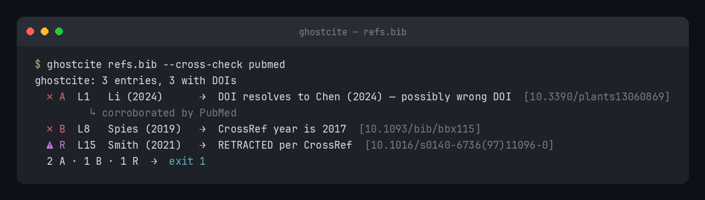

# ghostcite

[](https://pypi.org/project/ghostcite/)
[](https://github.com/musharna/ghostcite/actions/workflows/ci.yml)
[](LICENSE)
[](https://www.python.org/downloads/)

**Catch ghost citations — right DOI, wrong author.**

<p align="center"></p>

`ghostcite` is a deterministic, **no-LLM** command-line tool that cross-checks a
bibliography's _claimed_ author and year against CrossRef's canonical record for
each DOI. It catches the dominant ghost-citation failure mode — a reference whose
cited authorship doesn't match the paper the DOI actually points to — and flags
retracted or expression-of-concern works along the way.

## The problem

LLM-assisted writing (and plain copy-paste drift) routinely produces references
that _look_ right but attribute the cited DOI to the wrong authors or year. A
manuscript cites "Li et al. 2024," but DOI `10.3390/plants13060869` is actually
**Chen et al.** A reviewer catches it; an automated check catches it first.

`ghostcite` answers exactly one question, deterministically:

> Does the metadata you wrote for this citation match what CrossRef says the DOI actually is?

No model, no API key, no download. Just CrossRef's REST API and a comparison.

## Install

```bash
pip install ghostcite
```

## Usage

```bash
ghostcite refs.bib              # check a BibTeX file
ghostcite refs.md               # markdown reference list
ghostcite dois.txt              # bare DOI list (lookup + retraction sweep)
ghostcite refs.bib --json       # machine-readable output (for CI)
ghostcite refs.bib --dry-run    # parse + count only, no network
ghostcite refs.bib --fail-on author,year,retraction   # tune the CI gate
cat refs.bib | ghostcite -      # read from stdin
ghostcite refs.bib --cross-check pubmed   # corroborate against PubMed
```

Input format is auto-detected; override with `--format {auto,bibtex,markdown,doi}`.

### Flags

- **`--cross-check pubmed`** — adds PubMed/NCBI as a _second source of truth_.
  Each CrossRef finding is reconciled against PubMed's record for the same DOI:
  when PubMed backs CrossRef the finding is annotated `↳ corroborated by PubMed`;
  when PubMed instead agrees with what you _cited_, it's flagged
  `↳ ⚠ PubMed agrees with the cited author — CrossRef and PubMed conflict; verify
manually` (the tier is kept so you don't silently trust either source). PubMed
  can also _raise_ a finding CrossRef missed, or supply a record for a DOI absent
  from CrossRef. Optional `--ncbi-email` / `--ncbi-api-key` (or `NCBI_EMAIL` /
  `NCBI_API_KEY`) follow NCBI's E-utilities etiquette and unlock a higher rate
  limit; neither is required.
- **`--max-rps <n>`** — cap outbound requests per second. ghostcite already
  self-throttles to CrossRef's advertised rate limit (read from the response
  headers); `--max-rps` lets you be _more_ conservative still (the stricter of
  the two wins).
- **`--color {auto,always,never}`** — colorize the tier glyphs. `auto` (default)
  colorizes only on a TTY; `always`/`never` force it. [`NO_COLOR`](https://no-color.org/)
  is honored and wins even over `always`. `--json` output is never colorized.
- **stdin (`-`)** — pass `-` as the filename to read the bibliography from stdin,
  e.g. `cat refs.bib | ghostcite -` or `ghostcite - --format doi < dois.txt`.

See [`examples/`](examples/) for ready-to-run sample inputs and captured output.

### Real example

Given `refs.bib`:

```bibtex
@article{li2024,
  author = {Li, X},
  year   = {2024},
  title  = {Cell wall activity in Phelipanche},
  doi    = {10.3390/plants13060869},
}
```

```text
$ ghostcite refs.bib
ghostcite: 1 entries, 1 with DOIs
  ✗ A  L1  Li (2024)  →  DOI resolves to Chen (2024) — possibly wrong DOI  [10.3390/plants13060869]
  1 A
$ echo $?
1
```

The DOI is real; the claimed first author "Li" is not — CrossRef says it's Chen.

## Input formats

| Format       | Detection                                       | Yields claimed author/year?            |
| ------------ | ----------------------------------------------- | -------------------------------------- |
| **BibTeX**   | `@article{…}` / `@…{…}` entries                 | Yes (`author`, `year`, `doi`, `title`) |
| **Markdown** | bullet refs `- **AuthorList (YYYY).** … 10.x …` | Yes                                    |
| **DOI list** | newline-delimited bare DOIs / `doi:` / DOI URLs | No — lookup + retraction sweep only    |

A DOI-list run can't detect author/year mismatches (nothing is claimed to compare
against); it reports each DOI's canonical record and retraction status, and says so.

## Severity tiers

| Tier   | Meaning                                                               | Fails CI?                       |
| ------ | --------------------------------------------------------------------- | ------------------------------- |
| **A**  | author-mismatch — claimed first author isn't in CrossRef's authors    | Yes                             |
| **B**  | year-mismatch — author matches, claimed year differs                  | Yes                             |
| **C**  | cosmetic — matches only after diacritic/initials fold (Bürger≈Burger) | No (info)                       |
| **R**  | retraction / expression-of-concern per CrossRef                       | Yes (fires regardless of A/B/C) |
| **U**  | unresolvable — DOI 404s, or no-DOI entry search was inconclusive      | No (warn)                       |
| **OK** | first author + year match                                             | —                               |

When the claimed title also diverges strongly from CrossRef's title, a Tier A
finding is annotated **"possibly wrong DOI entirely"** to distinguish a wrong-author
citation from a wrong-DOI one.

## Exit codes

| Code | Meaning                                            |
| ---- | -------------------------------------------------- |
| `0`  | clean — no findings at or above the fail threshold |
| `1`  | findings present at/above the threshold            |
| `2`  | tool error (network down, unparseable input, …)    |

`--fail-on` (default `author,year,retraction`) selects which tiers force exit `1`;
pass `--fail-on none` to run as a passive reporter. Tiers `C` and `U` never force exit `1`.

## How it works

For each parsed citation:

1. If it has a DOI → `GET https://api.crossref.org/works/{doi}` for the canonical record.
2. If it has no DOI but has author/title → best-effort `GET /works?query.bibliographic=…`
   (results flagged **low-confidence**, never escalated above a warning on their own).
3. Compare claimed first-author surname (Unicode-folded, punctuation-stripped) and year
   against the canonical record; assign a severity tier.
4. Check `updated-by` / `update-to` / `relation` for retraction / expression-of-concern.

No language model is involved at any step. The comparison is pure and deterministic;
only the CrossRef client touches the network.

CrossRef requests carry a descriptive `User-Agent` with the project URL (the CrossRef
"polite pool"), never a personal email.

## CI / pre-submission gate

```yaml
# .github/workflows/citations.yml
- name: Check citations
  run: |
    pip install ghostcite
    ghostcite paper/references.bib --fail-on author,year,retraction
```

A non-zero exit fails the job, so a ghost citation blocks the merge before submission.

### GitHub Action

A composite Action ships in this repo, so you can drop ghostcite into a workflow
without a manual `pip install` step:

```yaml
# .github/workflows/citations.yml
jobs:
  citations:
    runs-on: ubuntu-latest
    steps:
      - uses: actions/checkout@v4
      - uses: musharna/ghostcite@v1
        with:
          paths: paper/refs.bib
          fail-on: "author,year,retraction"
```

The Action installs ghostcite from PyPI and runs it with `--color always` so the
findings are readable in the Actions log.

## Scope (v1)

`ghostcite` checks **metadata correctness** (does the DOI's record match what you
wrote), not claim support (does the source actually say what your prose claims) — that
is a separate, LLM-based concern. It does no auto-fixing and no citation-style linting.
CrossRef is the primary source of truth; `--cross-check pubmed` adds PubMed as an
optional second source for corroboration and conflict detection.

## Limitations

- CrossRef stores particle surnames inconsistently (`van der Berg` vs `Berg`), so a
  correctly-cited prefixed surname can rarely produce a Tier A false positive.
- No-DOI entries are resolved by best-effort bibliographic search and flagged
  low-confidence; treat those findings as hints, not verdicts.
- Some preprints, datasets, and protocols carry no author metadata in CrossRef and
  surface as Tier U ("author not verifiable") rather than a mismatch.
- A DOI absent from CrossRef can't be checked there; `--cross-check pubmed` can
  recover some of these when the DOI is indexed in PubMed.

## Related work

ghostcite's niche is **deterministic, no-LLM, CLI-first** checking focused on the
**byline-mismatch** failure mode (right DOI, wrong author/year) plus **retraction**
flagging — built to run unattended in CI.

| Tool                                                            | What it does                                | How ghostcite differs                                                       |
| --------------------------------------------------------------- | ------------------------------------------- | --------------------------------------------------------------------------- |
| [RefChecker](https://github.com/markrussinovich/refchecker)     | LLM-powered web-search reference validator  | ghostcite is no-LLM, deterministic, and CI-safe (no model, no API key)      |
| claude-skill-citation-checker                                   | A Claude Code skill for an LLM agent        | ghostcite is a standalone CLI + Action — no agent or LLM host needed        |
| [BibTeX Verifier](https://merfanian.github.io/Bibtex-Verifier/) | In-browser BibTeX checker                   | ghostcite is scriptable from the CLI and also flags retractions             |
| [CERCA](https://github.com/lidianycs/cerca)                     | Java / AGPL citation checker                | ghostcite is Python / MIT / `pip install`-able                              |
| [scite Reference Check](https://scite.ai/)                      | Commercial, PDF-oriented, retraction focus  | ghostcite is free / open-source, BibTeX-native, and catches byline mismatch |
| [doimgr](https://github.com/dotcs/doimgr)                       | Formats and manages DOIs (doesn't validate) | ghostcite verifies byline and retraction status, not just formatting        |

In short: if you want a deterministic, dependency-light gate that catches the
wrong-author and retracted-source cases in CI, ghostcite fills that gap; for
claim-level fact-checking or interactive PDF review, the LLM/commercial tools above
do more.

## FAQ

**Does it call an LLM?**
No. ghostcite is a deterministic comparison of the metadata you wrote against
CrossRef's (and optionally PubMed's) canonical record for each DOI. There is no
model, no prompt, and no API key required.

**Will it hit rate limits?**
It self-throttles to CrossRef's advertised rate limit, read from the live response
headers; use `--max-rps` to be more conservative. Requests carry a descriptive
`User-Agent` with the project URL to stay in CrossRef's polite pool.

**Does it catch fabricated DOIs?**
Indirectly. A DOI that 404s at CrossRef surfaces as Tier U (unresolvable). ghostcite's
core check is byline-vs-DOI _consistency_ — whether the DOI's record matches the
author/year you cited — rather than pure existence, so it catches the common case of a
real DOI attached to the wrong citation.

**Can I use it in CI?**
Yes. It exits non-zero when findings at or above the `--fail-on` threshold are present,
so a ghost citation fails the job. Use the CLI directly or the
[`musharna/ghostcite`](#github-action) GitHub Action.

## Roadmap

The original v1 roadmap — PubMed cross-check, `--max-rps` pacing, and stdin input —
is now **shipped**. Remaining ideas:

- Additional metadata sources (e.g. DataCite for datasets).
- Bundling an offline Retraction Watch dataset for retraction checks without a network
  round-trip.
- More input formats beyond BibTeX / Markdown / DOI lists.

## License

MIT — see [LICENSE](LICENSE).
